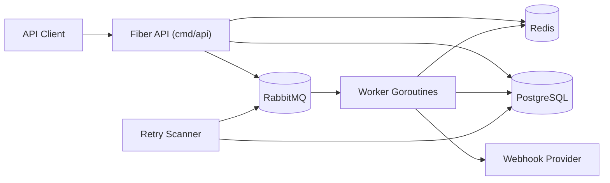
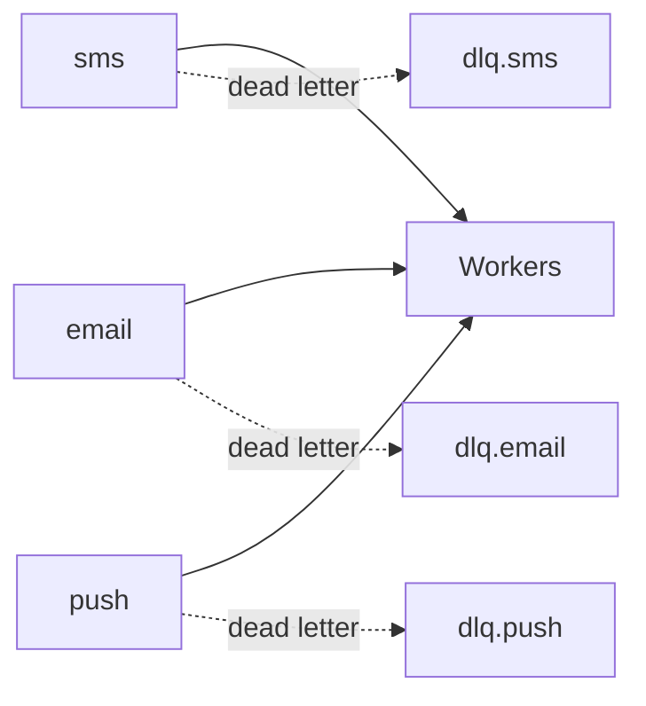
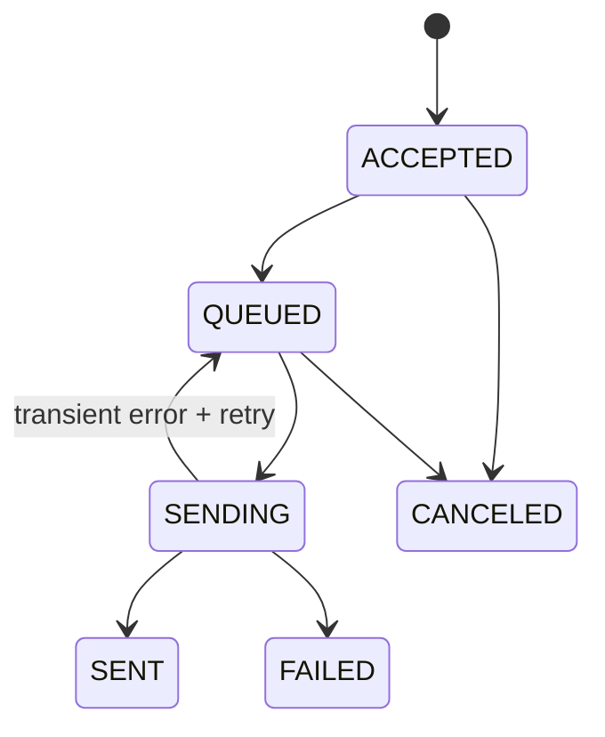

# Architecture & Design

This document explains Dispatch Engine's technical architecture, component boundaries, and core execution flows.

## 1. High-Level Architecture



The system uses a single-binary model: API, worker, and retry scanner run in the same process.

## 2. Layers

### Domain
- Path: `internal/domain`
- Responsibility: entity definitions, validation, lifecycle rules
- Main models: `Notification`, `NotificationAttempt`, `Batch`

### Application Service
- Path: `internal/service`
- Responsibility: business workflow orchestration
- Main services: `NotificationService`, `WorkerService`, `RetryScanner`

### Transport (HTTP)
- Path: `internal/handler`
- Responsibility: request parsing, response mapping, HTTP error translation

### Repository
- Path: `internal/repository`
- Responsibility: GORM-backed data access implementations

### Infrastructure / Adapter
- `internal/queue`: RabbitMQ publisher/consumer and topology
- `internal/provider`: webhook provider client
- `internal/infra/redis`: Redis client and rate limiter
- `internal/infra/postgresql`: DB connection and migrations
- `internal/observability`: logging and metrics

## 3. Data Model

### notifications
- identity: `id`, `correlation_id`, `idempotency_key`, `batch_id`
- routing: `channel`, `priority`
- payload: `recipient`, `content`
- lifecycle: `status`, `attempt_count`, `max_retries`, `next_retry_at`
- provider: `provider_message_id`
- timestamps: `created_at`, `updated_at`

### notification_attempts
- `notification_id`
- `attempt_number`
- `status_code`
- `response_body`
- `error`
- `created_at`

### batches
- `id`
- `total_count`
- `status` (`PROCESSING`, `COMPLETED`, `PARTIAL_FAILURE`)
- `created_at`, `updated_at`

## 4. Critical Indexes

Migrations define these indexes:
- `idx_notifications_status_channel_created`
- `idx_notifications_batch_id` (partial)
- `idx_notifications_idempotency_key` (unique partial)
- `idx_notifications_retry` (partial)
- `idx_notifications_correlation_id`
- `idx_attempts_notification_id`

These optimize list/filter queries, idempotency lookups, and retry scans.

## 5. Queue Topology



- Work queues: `sms`, `email`, `push`
- Dead-letter queues: `dlq.sms`, `dlq.email`, `dlq.push`
- Queue argument: `x-max-priority=3`

Priority mapping:
- `HIGH` -> `3`
- `NORMAL` -> `2`
- `LOW` -> `1`

## 6. Notification Lifecycle



`LockForSending` prevents duplicate concurrent sending for the same notification.

## 7. Create Flow (`POST /v1/notifications`)

1. Handler parses and validates request.
2. `NotificationService.Create`:
- persists notification as `ACCEPTED`
- publishes to channel queue in RabbitMQ
- updates status to `QUEUED`
3. API returns `202 Accepted`.

Note: if publish fails, the notification is marked as `FAILED` to avoid stuck `ACCEPTED` records.

## 8. Worker Processing Flow

`WorkerService.processMessage` pipeline:
1. `LockForSending` performs an atomic claim (`ACCEPTED/QUEUED -> SENDING`).
2. Check `Wait(channel)` on rate limiter.
3. Call provider send.
4. Persist attempt record.
5. Apply outcome:
- success: `SENT`
- transient failure with retries left: `QUEUED` + `next_retry_at`
- permanent failure or retries exhausted: `FAILED`

## 9. Retry Mechanism

`RetryScanner` periodically scans:
- `status=QUEUED AND next_retry_at <= now`

Due notifications are republished to channel queues.
After successful republish, `next_retry_at` is cleared to reduce duplicate scanner enqueue attempts.

Backoff policy:
- exponential: `1s, 2s, 4s, ...`
- max delay: `60s`
- jitter: `0..250ms`

## 10. Rate Limiting Design

`RedisRateLimiter` uses per-channel per-second windows:
- key: `ratelimit:<channel>:<unix-second>`
- counter incremented with `INCR`
- `EXPIRE` set on first increment
- sends are delayed when the limit is exceeded

This approach remains consistent across multiple replicas.

## 11. Error Mapping and HTTP Behavior

Domain errors are mapped to HTTP status codes:
- `ErrValidation` -> `400`
- `ErrNotFound` -> `404`
- `ErrConflict` -> `409`
- others -> `500`

Global error handler returns:

```json
{"error":"..."}
```

## 12. Observability

- Logging: Zap structured logger
- Metrics: Prometheus counters/histograms/gauges
- Probes:
- `/livez`: process liveness
- `/readyz`: PostgreSQL + Redis readiness

## 13. Trade-off: Single Binary

Why single binary in this project:
- simpler operations
- faster local development
- sufficient separation for assessment scope

For production, splitting API and worker into separate binaries/deployments is preferred for independent scaling and fault isolation.
